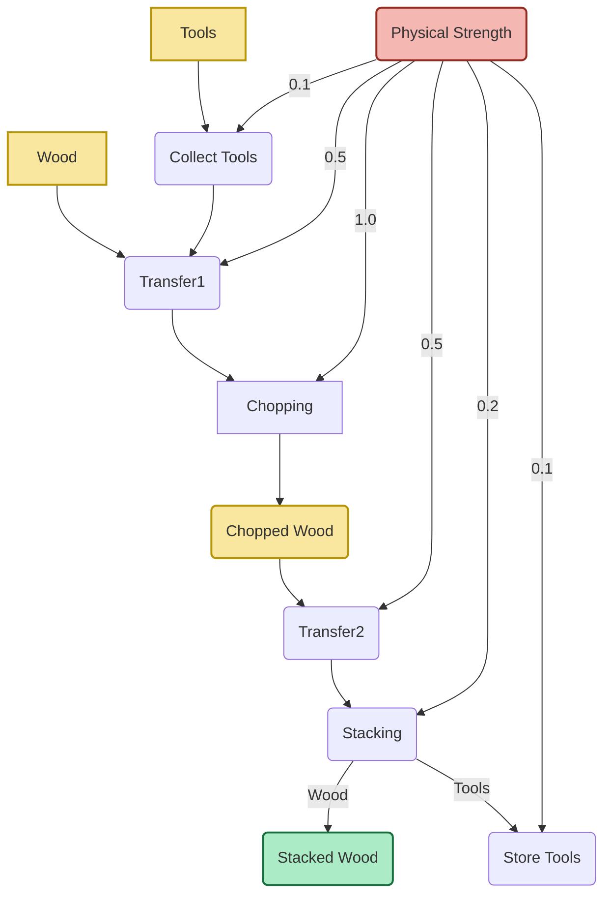
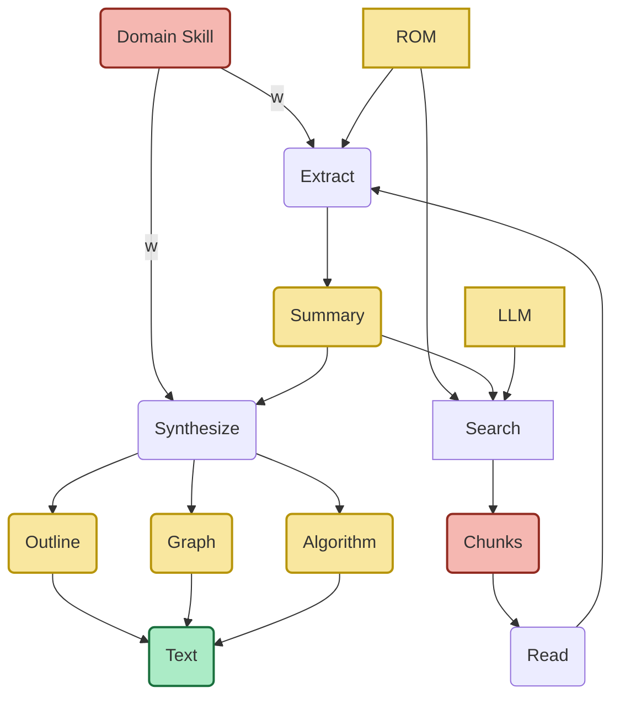

# Reflexive Loop: A framework for balancing building and learning

Copyright © 2025 Uroš Jovanovič, CC BY-SA 4.0.

**Background**: While thinking about design of a primal organism based on the Reflexive Organism Model (ROM), the questions around it were more and more about its purpose, about why would it exist, what would it experience, what would it seek. What would be the dynamics of the organism, what to expect through its growth. This meant understanding how this intent, the dynamics is them mapped into the ROM parameters. An alternative path to define such primal organism is to know the role of parameters and how they map into something from personal experience and observations.

**Intent**: Using ROM to track and observe my own activity and my own loops. Defining what the parameters mean in the context of everyday life, and exploring what we gain if we apply ROM to track ourselves.

**Method:** We'll start with a few components to not make it overly complicated and yet to still get the feeling for how ROM explains our daily activity. We'll create a activity vector to describe entries. Later we expand it to hierarchies and in the end reason about how to use the activity vector with reflexive conservation principle (RCP).

## Daily activity as ROM

Let's start with mapping daily activity to ROM components. We'll choose a subset of ROM functionality to make things simple to begin with. The two most important indicators of the dynamics are AI and EI. Let's look at what these could track and how to quantify them.

### Assembly Index (AI)

AI is all about measuring complexity of structure. Although the actual AI's quantification requires more details, one simple way is to just measure how many new structural units have been added in a window of time, for example on a daily.

These can be altered a bit as well, not counting just discrete events, but weighted by complexity and size of work. Complexity can be measured by level of innovation, as well as category of origin.

It really is about the structure it creates and evaluation of that structure. The structure should be taken as a graph, like how much components had to be assembled together, as well as how hard the assembly has been. Hard by either requiring structural work or informational, or conceptional. We are going to reuse these structures in the underlying graph $\mathcal{G}$ anyway.

How to assign a scalar to a structure? Once something is created, we should evaluate the number of components that it has been assembled from and how much effort assembly took. We really should be thinking in graphs. Not just graphs, but graphs of concepts, hierarchical graphs.

An example would be, where multiple units need to be assembled into something, but that something then is used as part of some other assembly as a single unit.

Let's look at a few examples to get the feeling of quantification.

- Chopping wood. What does it take? One have to use a wheelbarrow, an axe, move the larger logs, chop them into smaller ones, transfer them near the furnace, stack them. The most energy is needed to chop them and transfer them. The activity is mostly structural, has very little information required to be used.
- Writing this description from accumulated information. The amount of information available, number of different concepts that are used to be assembled. The most energy and time goes into figuring out how to write a coarse-grained summary and how to make it applicable, matching with the observation. The activity is mostly about information, it requires very little material effort, close to none.

These are the who extreme examples, one completely physical and one completely informational. But how to represent this activity through structure?

Let's explore how to think in terms of structures and complexity through graphs, starting with chopping wood. The graph bellow shows transitions of all concepts involved. Whether it is activity or resource.

The structure holds all ingredients needed as well as shows stages, transitions required to achieve the end structure of the activity, the new structural unit that we're considering. Yellow nodes represent resources, red are the critical resources that fuel all the activity. Green are final state assemblies. The rest are transitions. The arrows represent a connection to a transition. In this case activities like transfer or chopping are assemblies of resources or previous activities. The whole represents the assembly required to achieve stacked wood as a state.

What about it's AI as a scalar? The AI of doing this for one or two logs is different than doing it for full wheelbarrow. Hence, the input are the quantities of resources. When there are only arrows without weights, there is no addition to the assembly index.

The tools don't transit to the activity of collecting the tools. There is no assembly there. Only the physical strength adds to assembly. So the number of tools  (3) is multiplied with the weight. And the AI of collecting tools (CT) yields $AI_{CT} = 0.9$. If we take 20 large units of wood, then we need to add 20 to 3 from tools. And multiply that with 0.5 to get the AI of transfer, thus the AI of the first transfer is $AI_{T1}=11.5$. Chopping adds $AI_C=23$. 

In the end we would take a sum of all the intermediate AI's as well as the AI of the graph, and we obtain the AI of the stacked wood, that is based on the weighted sum of assembly steps needed to compose the structure.

Let't consider why this works. If we only want to chop one log, then the majority of AI "cost" is in the tools. The weight of the assembly structure is mostly the tools.

Let's look at the transit of stacking. The edges contain resources here, not weights. This is used to filter units. Because only units of wood are used for stacked wood and only tools are used for storing tools. These filters are used to decouple number of units in the processes. Otherwise the aggregation is passed between nodes.

Why do we include the AI of the graph? Because we would favor processes that are either easier (smaller weights), have less complexity (less edges and node). Such structures would be favored because they would produce smaller AIs for the same concept.

Why minimization of process would be used? If we look at just this process in isolation, maximization of AI required by ROM would translate into longer and more complex processes. However,  because there is a limited budget of physical strength resource, the more units of stacked wood the process produces with less units of strength, the more it can fuel other processes. Only when other constraints are added do we actually obtain minimization of the process as a automatic consequence. If unbounded, the complexity of the process grows unbounded as well.

What about the second case, the knowledge creation process? This one is actually more about the amount of chunks of information that needs to be composed and all possible ways to compose them. Closer to the metrics already mentioned in the assembly theory. Let's dive into it.

Why does the amount of chunks that need to be composed matter? We have two options here. One is to combine them into a sequence and the other one is to do coarse-graining, composing the essential description. The end goal is that the reconstructed information is reproducible, generates a process unlike the one above which can be used to either create new structures or to reuse the newly created structure in other processes.

The resources in knowledge-creation process graph are concept chunks (notes, papers, equations), or more self-contained descriptions (books). The enablers (unlike physical strength) are domain skills, tools like editors or LLMs. The common transitions for knowledge creation are search, read, extract, cluster, map, synthesize, draft, revise. The outcomes, reusable ones, would be outlines, argument graphs, algorithms, final text, diagrams.

The difference between knowledge assembly and resource assembly is in its reuse. The cost of reusing knowledge once assembled is zero, while the cost of resource assembly stays the same. The only thing that is being added to knowledge reuse is the connection in the structural graph. 

The graph represents the assembly process of knowledge creation. AI depends on number of chunks and the size of the chunks. Initial resource ROM stays mostly unchanged but is used for context and direction. The overall complexity is multiplied by weight of the domain skill. We can even use one that goes beyond 1 for the unfamiliar ones, 1 for neutral ones and closer to 0 if it's mostly just copy/paste without new information.

The majority of work goes into search, extracting and synthesizing. Given the number of chunks, the complexity of operations like reading adds to the index. The more complex operations like extracting and synthesis depend on the domain skill.
#### Application

We now have an idea how to define construction graphs of some concepts and use them to calculate the AI of generated structures, along with the structures themselves. Some nodes are resources and some nodes represent the transformation into another resource, the equivalent of a joint operation as multiple inputs are joint and effort (cost) to generate a joint structure.

The goal is to seek processes with smaller AI for the same end structure. And at the same time, to seek new structures that have have higher AI.

Note that these graphs are not exactly the graph $\mathcal{G}$ in ROM, however they are part of fast-flows, before they are written into the structure (the output).

What does one gain by doing this? If we're only interested in the amount of created structures and some qualitative weighting of these, then the definition of the process for creation of a structure is too much of an overhead. However, if we want to see how different aspects of life interact with each other and what parts and operations are frequently used, then such structures can provide the needed overview.

Not only this, but we could imagine these graphs being encoded as monads, where the created structure contains its assembly pathway along with its cost and complexity index. We would be able to write programs as assembly graphs and reason about them, optimize them, simulate, inspect, etc.
### Experience Index (EI)

EI is all about how much the system feels its own changes. In other words, once the choice of structure is selected and with it AI, that structure is written into state, memory, it is then "read back", this is when the "experience" happens. Measurement of predicted and actualized.

In other words, EI quantifies information flow that arises from prediction vs. actual outcome. That is, the bigger the difference between the expected and the observed, the bigger the gain in experience. The more we are right about something, the less the experience, because the predictions match the observations.

Before jumping into fully detailed definition of EI in the Reflexive Organism Model, let's explore what we'd expect the experience index to behave in the case of wood chopping and knowledge creation from the previous section.

Wood chopping is mostly physical activity. And the ability to perform the activity is where the EI hides. For example, one expects to be able to transfer 30 logs, chop them to smaller pieces and stack them. However, the number of logs might be too heavy to transfer, or the volume too big. And the actual number is lower. Or the the strength to actually chop them only holds for 20, but not 30, where the user starts to struggle. So the EI rises. However, high EI here is a negative experience mostly.

Let's define the **elementary experience contribution of an atomic action**. For any primitive operation $a$ (e.g., “chop a log”, “write a note”, “run a simulation”) we introduce two numbers:

 - $\hat{p}_a$: the *predicted* effect on the internal state that the agent expects before executing $a$.  
 - $\hat{o}_a$: the *observed* effect after execution (the actual change recorded in long‑term memory).

The **experience gain** of this step is taken as a distance between prediction and observation. A convenient scalar choice, used throughout ROM literature, is the *negative log‑likelihood* or simply the squared error:

$$
e_a \;=\; -\log p\big(\hat{o}_a \mid \hat{p}_a\big)\;\approx\; \|\hat{o}_a-\hat{p}_a\|^2 .
$$

This term is always non‑negative and grows when the system “feels” a larger surprise (i.e. a bigger mismatch between expectation and reality).

Just as AI for a process is obtained by summing (or weighted‑summing) the scalar costs of all assembly steps, we obtain a *scalar EI* for an entire process by adding up the elementary experience gains:

$$ EI = \sum_{a\in \text{process}} e_a. $$

Note that in the equation for the purpose function $\mathcal{J}= (\mathrm{AI})^{\alpha}\, (EI^{\star})^{\beta},$ the $\beta$ in the process of chopping wood is $\beta \approx 0$, as we're not inventing new methods nor testing new tools most of the time. For wood chopping one would typically set $\alpha\gg\beta$ (the goal is to build a pile of logs).

In the “knowledge creation” scenario the primitive actions are mental like forming a hypothesis, performing an experiment, reading a result, updating a model.

-  **Hypothesis formation** is all about predicted outcome, defined as some distribution over results, while the observation is about actual experimental data.  
- **Experiment execution** deals with prediction in terms of expected measurement values, while observation provides the actual measured values.

Because scientific reasoning is intrinsically uncertain, the prediction‑observation gap tends to be larger, so each $e_a$ will be higher than in the chopping case. For instance:

$$
e_{\text{hypothesis}} = -\log p(\text{data}\mid\text{hypothesis}) \approx 1.2,
$$
$$
e_{\text{experiment}} = (\text{observed} - \text{expected})^2 \approx 0.8 .
$$

Adding them up yields a scalar  

$$EI_{\text{knowledge}} = \sum_a e_a \; \approx\; 2.0,$$

which is noticeably larger than the chopping EI, reflecting that the organism *feels* more experience when it learns something new.
   
The above holds if we can define distributions, or have precise measurement values. However, in case of more abstract concepts that feel qualitative in nature, like hypothesis, or quality of a query, etc. we can use kernel-induced metric to measure distances between abstract objects.

#### Qualitative states 

In the knowledge creation case, most of the “observations’’ are **qualitative**:

* a query is *interesting* or *boring*,
* a hypothesis feels *plausible* or *far‑fetched*,
* an experiment gives a result that *looks promising* or *inconclusive*.

There is no ready‑made numeric probability distribution for these mental states. We nevertheless need a scalar that tells the system how much it felt each step. The ROM literature already uses a kernel‑induced metric to measure distances between abstract objects and we can borrow exactly that idea.

 1. **Choose a set of descriptive attributes** for each step.  Example for a hypothesis are novelty (0–1), coherence with known facts (0–1), confidence in prediction (0–1).  **A feature vector** $\mathbf{z}_a$ for each elementary action $a$ for hypothesis generation would be:  

   $$
   \mathbf{z}_{\text{hyp}} = 
   \begin{bmatrix}
   \text{novelty}\\
   \text{coherence}\\
   \text{feasibility}\\
   \text{expected impact}
   \end{bmatrix}
   \in[0,1]^4 .
   $$
 
 2. **Embed the attribute vector $\mathbf{z}_a$** into a reproducing‑kernel Hilbert space (RKHS) with a kernel $K$.  A simple Gaussian kernel works well:

   $$
   K(\mathbf{z},\mathbf{z}') = \exp\!\Bigl(-\frac{\|\mathbf{z}-\mathbf{z}'\|^{2}}{2\sigma^{2}}\Bigr).
   $$

3. **Define the distance** as the RKHS norm of the difference of two embeddings:

   $$
   d_{\ell}^{2}(a,b)=\bigl\|\sigma^{1/2}K(\mathbf{z}_a,\cdot)-\sigma^{1/2}K(\mathbf{z}_b,\cdot)\bigr\|_{2}^{2},
   $$

   which is exactly the **Riemannian 3‑metric** from the paper.  
   The “prediction” $\hat p_a$ and the “observation’’ $\hat o_a$ are simply two points in this latent space (e.g., *expected novelty* vs *observed novelty*).

4. **Compute the surrogate surprise**:

   $$
   e_a \;\approx\; d_{\ell}^{2}(\text{prediction},\text{observation}),
   $$

   which is a scalar that can be summed across all steps to obtain the episode EI.

Because the kernel distance works with *any* vector of descriptors, we do **not** need an explicit probability distribution; the geometry of the embedding supplies the “likelihood‑like” measure automatically.

The purpose functional can now be written as

$$
\mathcal J = \bigl(\mathrm{AI}\bigr)^{\alpha}
            \; \times\;
            \Bigl( \underbrace{\sum_{a} d_{\ell}^{2}(\mathbf{z}_{p,a},\mathbf{z}_{o,a})}_{\displaystyle EI^{\star}} \Bigr)^{\beta},
$$

or, in the log‑product form,

$$
r_t = \alpha\,\log(\mathrm{AI}_t+\epsilon)
      -\beta\,\log\!\Bigl( 1 + \sum_{a} d_{\ell}^{2}(\mathbf{z}_{p,a},\mathbf{z}_{o,a})\Bigr).
$$

The **negative sign** (or setting $\beta<0$ if you want a penalty) makes a *large* kernel‑distance—i.e. a strong feeling of “this did not match my expectation”—reduce the reward, exactly as we experienced with the wood‑chopping example where high EI was a negative experience.

## Energy and motivation

When we feel “reluctant” or “tired”, two things are happening simultaneously:

1. **Physical / mental energy budget is low**. The *cost* of adding to $AI$ rises (we need more strength, attention, time).  
2. **The expected payoff in terms of EI drops**. We anticipate that the effort will not be “felt” later (the structure may stay unused, the code may never run, the move may feel pointless).

Thus “tiredness” can be formalised as a **dynamic increase in the marginal cost of AI** and a **decrease in the anticipated EI reward**.

Recall the purpose functional $\mathcal J = \bigl(AI\bigr)^{\alpha}\,\bigl(EI^{\star}\bigr)^{\beta},\quad\alpha,\beta>0.$

When an actor is fresh, $\alpha$ and $\beta$ can be set to the values that reflect its long‑term goals (e.g. $\alpha=1,\;\beta=1$).  When fatigue hits we introduce two *state‑dependent* modifiers:

| Modifier                              | Symbol                      | Effect on the functional                                                           |
| ------------------------------------- | --------------------------- | ---------------------------------------------------------------------------------- |
| **Energy availability**               | $E_{\text{res}}(t)\in[0,1]$ | Scales the effective AI contribution: $\tilde\alpha(t)=\alpha\,E_{\text{res}}(t)$. |
| **Motivation / perceived usefulness** | $M(t)\in[0,1]$              | Scales EI: $\tilde\beta(t)=\beta\,M(t)$.                                           |

The *instantaneous* reward becomes 

$$r_t = \tilde\alpha(t)\,\log\!\big(AI_t+\epsilon\big) + \tilde\beta(t)\,\log\!\big(EI^{\star}_t+\epsilon\big).$$

When we are **tired**:

* $E_{\text{res}}(t)$ drops, the log‑AI term is down‑weighted, so the optimizer will *avoid* high‑AI actions (e.g., moving heavy furniture).  
* If we also feel that the result will be **unused**, $M(t)$ falls → the EI term shrinks and we are less motivated to invest in detailed work.

We now have a **quantitative lever**:

$$\tilde\alpha(t)=\alpha\,E_{\text{res}}(t),$$
$$\tilde\beta(t)=\beta\,M(t).$$

**Scale $\alpha$ and $\beta$ with an energy‑availability signal $E_{\text{res}}$ and a motivation signal $M$**.  

## Keep it simple

We've explored various ways one can come to an index that most resembles observations and predictions. However, such computations require high cost. We should start with something simpler, which would allow us to track and generate the self-optimizing loop that the ROM describes.

First, start with a simple heuristics defined by the sense of **energy level**. ROM tells us that a low $E\_{res}$ forces one to *lower expectations* on both AI and EI.  Let's use a simple rule:

| Energy state                                        | Action                                                                                                                              |
| --------------------------------------------------- | ----------------------------------------------------------------------------------------------------------------------------------- |
| **High** (≥ 80 % of usual sleep, no mental fatigue) | Keep normal AI targets, aim for $\beta$ > 0.2.                                                                                            |
| **Medium** (50‑79 %)                                | Reduce AI weight by 30 %, set EI\_pred = 0.5 × previous.                                                                            |
| **Low** (< 50 %)                                    | Switch to “maintenance mode”: only write *reflection* entries, no new code; treat the day as a **pure EI‑only** episode (β≈1, α≈0). |

Because $\beta(t)$ is automatically raised when EI stays high, this rule lets the system self‑regulate: on low‑energy days one still gets internal reward from pure reflection, preventing the loop from collapsing.

Let's explore the meaning of the parameters in more detail. 

### $\alpha(t)$ – weight on *structure* (AI)

| Regime              | Symbolic range   | ROM condition (energy‑driven)                                                                                                                                                                                                                                                                                                                                   | Interpretation                                                                                                                                                                              |
| ------------------- | ---------------- | --------------------------------------------------------------------------------------------------------------------------------------------------------------------------------------------------------------------------------------------------------------------------------------------------------------------------------------------------------------- | ------------------------------------------------------------------------------------------------------------------------------------------------------------------------------------------- |
| **Negative**        | $\alpha$ < 0     | **Severe energy deficit**: $E_{\text{res}}(t)\ll 1$ *and* a strong external constraint that penalises any additional structure (e.g., safety limit, physical injury). We have $\tilde\alpha(t)=\alpha\,E_{\text{res}}(t)$; if $E_{\text{res}}$ is near zero the optimizer will *invert* the sign to avoid building at all (the cheapest thing is “do nothing”). | The organism **actively suppresses** new assembly; it prefers to *remove* or de‑allocate existing structures.                                                                               |
| **Around zero**     | $\alpha$ ≈ 0     | **Energy low but not catastrophic**, or the task is explicitly “maintenance only”.  $E_{\text{res}}$ may be ~0.3–0.5 and the planner decides that any AI cost would outweigh the marginal benefit.                                                                                                                                                              | The system is *neutral* to building; it will only create structure if forced by an external imperative.                                                                                     |
| **Between 0 and 1** | 0 < $\alpha$ < 1 | **Normal‑to‑moderate energy**: $E_{\text{res}}$ in the range 0.5–0.8.  The scaling rule $\tilde\alpha(t)=\alpha\,E_{\text{res}}(t)$ yields a *damped* AI contribution.                                                                                                                                                                                          | The organism builds, but **conservatively** – prefers low‑cost actions (small code modules, short notes).                                                                                   |
| **Exactly 1**       | $\alpha$ = 1     | **Baseline**: $E_{\text{res}}≈1$ (well rested, fully motivated) and the default parameter choice of the model. This is the “neutral” weighting used in most examples.                                                                                                                                                                                           | AI contributes linearly to $\mathcal J$; each unit of structure adds the same marginal value as before.                                                                                     |
| **> 1**             | $\alpha$ > 1     | **High energy & strong drive for expansion** – e.g., after a successful sprint, after a “growth‑mode” signal (funding round, competition).                                                                                                                                                                                                                      | **Super‑linear reward for building**: each extra unit of AI multiplies the overall purpose more than proportionally, encouraging aggressive construction (large projects, big experiments). |

### β(t) – weight on *experience* (EI)

| Regime              | Symbolic range   | ROM condition (motivation / usefulness)                                                                                                                                                                                                                 |
| ------------------- | ---------------- | ------------------------------------------------------------------------------------------------------------------------------------------------------------------------------------------------------------------------------------------------------- |
| **Negative**        | $\beta$ < 0      | **Perceived strain or harmful surprise**.  When EI spikes are interpreted as “pain” (e.g., wood‑chopping overload), the system flips the sign so that larger EI *reduces* $\mathcal J$.                                                                 |
| **≈ 0**             | $\beta$ ≈ 0      | **No meaningful feedback loop** – either an actor is on a pure production day (no reflection) or it has deliberately set $M(t)\approx 0$ because it expects the output to be unused.  The modifier $\tilde\beta(t)=\beta\,M(t)$ shrinks EI’s influence. |
| **0 < $\beta$ < 1** |  Between 0 and 1 | **Typical reflective day** with moderate motivation $M(t)\in[0.5,0.8]$.  The system values experience but not enough to dominate the decision.                                                                                                          |
| **= 1**             | $\beta$ = 1      | **Balanced baseline** – the default used when we start a “learning‑by‑doing” routine.                                                                                                                                                                   |
| **> 1**             | $\beta$ > 1      | **High‑EI regime**: recent EI average is well above the threshold. The system now *prefers* actions that generate rich feedback (journalling, code review) even if they cost AI.                                                                        |

### The purpose functional $\mathcal J(t)=AI^{\alpha(t)}EI^{\beta(t)}$ 

| Value of $\mathcal J$ | Interpretation                                                                                                                                                                                                                                                                                                 |
| --------------------- | -------------------------------------------------------------------------------------------------------------------------------------------------------------------------------------------------------------------------------------------------------------------------------------------------------------- |
| **Very low** (≈ 0)    | Either one has done almost nothing (AI≈0, EI≈0) *or* it is in a regime where one exponent is negative and the corresponding term dominates (e.g., severe strain, $\beta<0$, large EI).  The organism’s current policy is **unprofitable**; ROM predicts a pressure to change either energy level or task type. |
| **Moderate**          | A healthy balance: AI and EI are both positive, exponents are ≥ 0, and the product reflects a *steady* growth trajectory.                                                                                                                                                                                      |
| **High & rising**     | The loop is in a **self‑reinforcing phase** – high reuse → high $\beta$ → more reflective actions → further increase of EI.  This is the “coherent” regime where coupling improves and the hierarchy moves from thermalised to coherent.                                                                       |
| **Plateau**           | The product stops growing because one factor has saturated (e.g., an actor has built all it can with current energy, or EI cannot increase because reuse has dried up).  ROM suggests either *inject new AI* (raise α) or *increase compatibility* to revive $\rho_t$.                                         |

### The derivative $\dot{\mathcal J}(t)$ – the **gradient that drives policy updates**

Take logs to see the gradient more clearly:

$$
\ln \mathcal J = \alpha(t)\,\ln AI + \beta(t)\,\ln EI.
$$

Differentiating w.r.t. time:

$$
\frac{\dot{\mathcal J}}{\mathcal J}
   = \underbrace{\dot\alpha\,\ln AI}_{\text{change of weighting}}
     + \underbrace{\alpha\,\frac{\dot{AI}}{AI}}_{\text{structural growth rate}}
     + \underbrace{\dot\beta\,\ln EI}_{\text{change of weighting on experience}}
     + \underbrace{\beta\,\frac{\dot{EI}}{EI}}_{\text{experience‑growth rate}}.
$$

**What each term tells the organism**

| Term                           | When it is positive → what the system does                                                                                                                                                                  |
| ------------------------------ | ----------------------------------------------------------------------------------------------------------------------------------------------------------------------------------------------------------- |
| $\alpha\,\dfrac{\dot{AI}}{AI}$ | **Building faster** than before (more nodes per unit time).  If this dominates, ROM will keep allocating AI‑budget.                                                                                         |
| $\beta\,\dfrac{\dot{EI}}{EI}$  | **Experience improving** – more surprise is being turned into useful feedback (e.g., many reads, good predictions).  When this term dominates the policy shifts toward reflection, journalling, or sharing. |
| $\dot\alpha\,\ln AI$           | The *weight* on structure is being adapted (e.g., energy rises → $\alpha$ ↑).  A positive value means the system has recognized that it can afford to build more.                                           |
| $\dot\beta\,\ln EI$            | The *weight* on experience is being adapted (e.g., recent high EI → $\beta$ ↑).  Positive sign pushes the organism to seek richer feedback loops.                                                           |

**Practical use**

- **If $\dot{\mathcal J}>0$**: actor's current schedule (mix of AI‑heavy and EI‑heavy actions) is *profitable*. Keep it.
- **If $\dot{\mathcal J}<0$**: one or more components are dragging the product down. Diagnose:
  - Is $\dot{AI}<0$? → An actor is over‑exerting; lower AI (rest, prune).  
  - Is $\dot{EI}<0$? → Reuse has dried up; increase sharing or add translation layers raise $\rho_t.$  
  - Are $\dot\alpha<0$ or $\dot\beta<0$? → Energy or motivation signals have fallen; consider a break or a motivational boost.

### Quick decision table – “What exponent should I expect given my state?”

| State of the day                      | $E_{\text{res}}$ (energy) | $M(t)$ / reuse $\rho_t$                | Expected $\alpha(t)$  | Expected $\beta(t)$                                |
| ------------------------------------- | ------------------------- | -------------------------------------- | --------------------- | -------------------------------------------------- |
| **Fully rested, high reuse**          | ≈ 1                       | > 0.8                                  | 1 → > 1 (maybe 1.2)   | 1 → > 1 (e.g., 1.3)                                |
| **Tired but still motivated**         | 0.4–0.6                   | 0.5–0.7                                | 0.5 → 0.8             | 0.7 → 1.0                                          |
| **Exhausted, low reuse**              | < 0.2                     | < 0.3                                  | < 0 (negative) or ≈ 0 | ≤ 0 (often negative if overload)                   |
| **Pure production sprint (deadline)** | 0.6–0.8                   | deliberately set to 0 (no sharing yet) | > 1 (aggressive AI)   | ≈ 0 ($\beta$≈0, see wood‑chopping case)            |
| **Learning/training session**         | 0.7–0.9                   | high reuse expected (self‑test)        | ~1                    | > 1 ($\beta$ boosted to capture learning surprise) |

## Example

### Identify the observable signals in the entry  

| Diary observation                                                                                     | Which ROM component it speaks to                                                                                 |
| ----------------------------------------------------------------------------------------------------- | ---------------------------------------------------------------------------------------------------------------- |
| “When I narrowed down the task for today, the energy for engagement rose.”                            | **Motivation M(t)** ↑ because the goal is clear; also **energy $E_{res}$** feels higher (one is fresh).          |
| “Whenever I start to think about other things, it dropped again.”                                     | **Motivation M(t)** ↓ (task‑switching creates distraction).                                                      |
| “Adding new information feels heavy, repulsive … lowers motivation.”                                  | **Energy $E_{res}$** ↓ (cognitive load) → both $\tilde\alpha(t)$ and $\tilde\beta(t)$ are reduced.               |
| “When I saw how some parts fit and that the composition is reusable, motivation to finish increased.” | **Experience index EI** spikes because a successful *reflection* loop closed; this boosts $\beta$‑scaled reward. |
| “I want to finish a simple version of the heuristics today.”                                          | **AI** (new structural units) will be low – an actor is only adding a few discrete steps, not a large graph.     |

### Set the *baseline* parameters  

When the actor is fresh and un‑fatigued we use the neutral baseline:

$$
\alpha = 1,\qquad \beta = 1,
$$
$$
E_{\text{res}}(t)=1,\qquad M(t)=1.
$$

These values give a **linear** contribution of AI to the cumulative purpose functional $\mathcal J.$  

### Apply state‑dependent modifiers

The diary tells us that the actor is **partially fatigued** and sometimes *highly motivated* when a piece clicks. We therefore scale the baselines:

| Situation | Modifier value (≈) | Scaled α / β |
|-----------|-------------------|--------------|
| Fresh, focused on a narrow task | $E_{\text{res}}=0.9$, $M=0.95$ | $\tilde\alpha = 1\times0.9 = 0.9$ |
| Distraction / heavy new info | $E_{\text{res}}=0.5$, $M=0.4$ | $\tilde\alpha = 0.5$ (strongly reduced) |
| “Success‑sprint” after seeing reusable composition | $E_{\text{res}}=0.85$, $M=1.0$ | $\tilde\beta = 1\times1.0 = 1.0$ (full boost) |

Thus the **instantaneous reward** at any moment *t* becomes  

$$
r_t = \underbrace{\tilde\alpha(t)\,\log\!\big(AI_t+\epsilon\big)}_{\text{structure building}} 
      + \underbrace{\tilde\beta(t)\,\log\!\big(EI^{\star}_t+\epsilon\big)}_{\text{experience/reflection}} .
$$

Note that if an actor is in a “high‑energy, growth‑mode” phase,  we could let $\alpha > 1$ – e.g. $\alpha = 1.3$ – which would make the AI term **super‑linear**, encouraging one to take on larger projects. In the diary, however, the dominant pattern is **energy‑limited**, so we stay ≤ 1.

### Compute a sample reward for today  

Assume the following rough counts (derived from the entry):

* **AI** – the actor added 3 new “structural units” (the simple heuristics steps).  
* **EI\*** – the actor achieved one successful reflection (“saw how parts fit”), giving an experience boost that we treat as a value of 4 (because it felt reusable).

Pick a moment when the actor was *focused* ( $E_{\text{res}}=0.9, M=0.95$ ):

$$
\tilde\alpha = 0.9,\qquad \tilde\beta = 0.95.
$$

Plug into the instantaneous reward with $\epsilon =10^{-6}$ for numerical stability:

$$
r_t = 0.9\,\log(3+10^{-6}) + 0.95\,\log(4+10^{-6})
     \approx 0.9\times1.099 + 0.95\times1.386
     \approx 0.989 + 1.317 = 2.306 .
$$

When an actor hits a distraction ( $E_{\text{res}}=0.5, M=0.4$ ) and AI is still 3 but EI drops to 1 (no reflection), the reward collapses:

$$
r_t^{\text{distracted}} = 0.5\,\log(3) + 0.4\,\log(1)
                       \approx 0.5\times1.099 + 0
                       = 0.55 .
$$

**Interpretation:** The diary’s qualitative feeling (“motivation rose” vs “energy drained”) is captured quantitatively by the swing from ~2.3 to ~0.55 in the reward signal.

### From instantaneous reward to the cumulative purpose $\mathcal J$

If we sum (or integrate) $r_t$ over the day, we obtain the **cumulative objective**:

$$
\mathcal J = \sum_{t=1}^{T} r_t .
$$

Because the AI term is *linear* when $\alpha=1$, each additional structural unit contributes a constant marginal value. When an actor deliberately raises $\alpha > 1$ during a “growth‑mode” sprint, the contribution becomes **super‑linear**, making large projects disproportionately rewarding.

### Quick checklist for future entries  

| Diary cue                               | Parameter to adjust                                       | Why                                                                                     |
| --------------------------------------- | --------------------------------------------------------- | --------------------------------------------------------------------------------------- |
| “clear, narrow goal”                    | ↑ M(t) (→ $\tilde\beta$)                                  | Reflection becomes easier; experience reward rises.                                     |
| “fatigued / heavy info”                 | ↓ $E_{res}(t)$, ↓ M(t) → lower $\tilde\alpha,\tilde\beta$ | Both AI and EI rewards shrink, matching the feeling of low energy.                      |
| “big breakthrough, reusable component”  | ↑ $\beta$ or set $\beta>1$                                | Gives **super‑linear** experience reward, encouraging an actor to seek more such loops. |
| “after a funding round / new resources” | Set $\alpha>1$                                            | Makes building new structure especially attractive.                                     |

## Concrete ways to use AI and EI

### Self‑diagnostic dashboard (the “ROM health check”)

| Dashboard element     | Interpretation                                                                                                                                                    |
| --------------------- | ----------------------------------------------------------------------------------------------------------------------------------------------------------------- |
| **AI / day** (bar)    | How much new structure you generated today.                                                                                                                       |
| **EI / day** (line)   | Cumulative surprise – a high value means many mismatches between expectation and outcome.                                                                         |
| **AI ÷ EI ratio**     | >1 → “construction‑heavy” (you build a lot but feel you’re missing the mark). <1 → “experience‑heavy” (you spend time reflecting, perhaps at the cost of output). |
| **Trend over 7 days** | A rising AI with a *stable* EI indicates learning: you are getting better at predicting your own performance.                                                     |

### Goal setting through the **purpose functional**

Pick a *desired* balance by fixing $\alpha,\beta$.  Example:

| Goal                                           | Desired $(\alpha,\beta)$ | Rationale                                                                                                |
| ---------------------------------------------- | ------------------------ | -------------------------------------------------------------------------------------------------------- |
| “Produce more artefacts, keep learning modest” | $\alpha=1.2,\;\beta=0.5$ | The log‑product reward will push the optimizer toward higher AI while still penalising large EI spikes.  |
| “Explore new ideas, avoid burnout”             | $\alpha=0.6,\;\beta=1.4$ | Emphasises reducing surprise – you deliberately take on tasks where you can test expectations and learn. |

Every day compute  

$$
r_{\text{day}} = \alpha\,\log(AI_{\text{day}}+\epsilon)
               + \beta\,\log(EI_{\text{day}}^{\star}+\epsilon),
$$

and aim to **increase** $r_{\text{day}}$ week over week.  This is exactly the log‑product reward, but now you are the *agent* that adjusts your schedule to maximise it.

### Adaptive planning loop (the “EI‑guided scheduler”)

1. **Morning** – write a brief plan and assign an *expected AI* for each planned block (e.g., “write 2 pages → AI≈5”).  
2. **During the block** – after finishing, rate the *actual* outcome (how many pages, how much novelty). Compute the surprise $e_a$ via Eq. (1) or kernel distance.  
3. **If $e_a$ exceeds a threshold** (say 0.5), trigger an **adjust‑policy** step:  
   * Reduce the size of the next block,  
   * Add a “reflection” sub‑task (read back notes, annotate),  
   * Or allocate more resources (extra time, better tools).  

This is precisely the **EI‑RL principle**; the agent uses its own internal information flow to reshape future actions.

### Identifying “fragile” vs. “antifragile” habits

If you notice a **steady increase** in EI while AI stays flat, the overhead of reflection (too many notes, endless re‑reading) is outweighing benefits – prune or batch those reflective steps.

Conversely, a **decreasing EI with rising AI** signals *antifragility*, the system learns from each surprise and becomes more efficient at building.  Reinforce this pattern by:

* Keeping the “reflection” step lightweight (e.g., a one‑sentence summary instead of a full report).  
* Using **coarse‑graining** – aggregate many small observations into a single higher‑level signal, reducing noise.

### Long‑term habit optimisation via multi‑level objective  

* **Level‑0** (hourly): compute $AI_h,EI_h$ for each hour.  
* **Level‑1** (daily): aggregate with a geometric mean to keep minority “high‑EI” hours from being drowned out:  

  $$
  EI_{\text{day}}^{\star}= \bigl(\prod_{h=1}^{24} (EI_h+\epsilon)^{w_h}\bigr)^{1/\sum w_h}.
  $$

* **Level‑2** (weekly): repeat the same aggregation.  

This mirrors the *parent–child* coarse‑graining and ensures that occasional high‑surprise events (a breakthrough idea or a nasty mistake) are not lost in the average.

## A minimal “first‑run” recipe  

1. **Instrument** the activity you care about (e.g., enable a plugin that records every new markdown file with its word count).  
2. **Define chunk weights** – for text use `w = tokens/1000`; for code use `w = files × complexity_factor`.  
3. **Compute AI daily**:  

   $$
   AI_{day}= \sum_{\text{new nodes}} w_i .
   $$

4. **Collect a simple prediction** before each session (e.g., “I expect to finish 2 notes, usefulness = 0.7”). After the session record the observed outcome and compute an elementary surprise  

   $$
   e_a = (\hat o_a-\hat p_a)^2
   $$

   or, if you have richer descriptors, use the kernel distance.  
5. **Aggregate EI** (sum of all `e_a`).  
6. **Read your energy & motivation signals** – a quick self‑rating (0–1) or an automated HRV readout → `E_res`, `M`.  
7. **Calculate the reward**  

   $$
   r_{day}= (\alpha\,E_{\text{res}})\,\log(AI_{day}+ε)+(\beta\,M)\,\log(EI_{day}+ε).
   $$

8. **Plot** `r_day`, `AI_day`, `EI_day` and the derivative of `𝓙 = AI^{α}·EI^{β}`. Adjust `α, β` according to the decision table (e.g., switch to `α≈0, β≈1` on low‑energy days).

After **one week** you will already see patterns such as “my AI spikes on Mondays while EI stays flat → I’m over‑building”, or “EI climbs after every reflection session → my learning loop works”.

---
## Appendix A: Agents

Although the document is intended for personal use, it can also be used as a guide for policy design for agents that are not operating in a fully reflective environment. Note also that the whole ROM is simplified here for manual evaluation of attributes, also to get the feel how ROM can drive understanding of ones activities. One can also use the scaled down version of heuristics and policies to get the feeling of reflexive loops, before investing more effort into building fully featured models.

A quick reminder what the presented method enables:

- **Endogenous purpose, not exogenous reward.** The method turns *experience geometry* (EI) and *assembly work* (AI) into the objective, the agent “feels” its own mismatch and values its own structure explicitly.
- **Graph-level credit and reuse.** Construction graphs make *how* something was built first-class; simpler, reusable pathways are preferred, not just high scores. 
- **Energy-aware policy gating.** $\tilde\alpha=\alpha E_{\text{res}},; \tilde\beta=\beta M(t)$ turns fatigue or low usefulness into automatic mode switches (build → reflect/maintain).

The summary makes it clear that this is a simplification of the reflexive loop and model representation and dynamics. However, it might be enough to start exploring systems that maintain internal order and reflexivity while conserving energy and experience balance. Or to explore the behaviour of self-modelling, self-regulary organisms in some chosen environment, not just reward maximizers.

### “Living with ROM” versus Classical Reinforcement Learning

| Aspect                                               | Classical RL (the textbook formulation)                                                                                                                                                                                                     | “Living with ROM” heuristics                                                                                                                                                                                                                                                                                                                                                                  |
| ---------------------------------------------------- | ------------------------------------------------------------------------------------------------------------------------------------------------------------------------------------------------------------------------------------------- | --------------------------------------------------------------------------------------------------------------------------------------------------------------------------------------------------------------------------------------------------------------------------------------------------------------------------------------------------------------------------------------------- |
| **State-action–reward loop**                         | *External* scalar reward $r_t$ supplied by the environment; the agent learns a policy $\pi$ that maximizes $\mathbb{E}[\sum\gamma^tr_t]$. The reward is usually hand-crafted and **does not depend on the agent’s own internal variables**. | Reward is **generated internally** from two first-principle quantities: **Assembly Index (AI)** – how much structure you have built, and **Experience Index (EI)** – how strongly the current outcome deviates from your own predictions. The instantaneous reward is a *log-product* of those two terms:  $\displaystyle r_t=\alpha\log(AI_t+\epsilon)+\beta\log(EI_t^{\star}+\epsilon)$. |
| **What the agent tries to maximise**                 | One scalar $R=\sum\gamma^tr_t$. The shape of the objective is fixed once you pick the reward function.                                                                                                                                      | A *purpose functional* $\mathcal{J}=AI^{\alpha}(EI^{\star})^{\beta}$. By changing the exponents $\alpha$ and $\beta$ – possibly **dynamically** through energy-availability ($E_{\text{res}}$) and motivation ($M$) modifiers – you can shift the optimisation focus from pure construction to pure reflection, or anywhere in between.                                                       |
| **Source of “surprise” / learning signal**           | Usually a *temporal-difference* error $\delta=r+\gamma V(s')-V(s)$ that measures prediction error on the external reward.                                                                                                                   | The **Experience Index (EI)** is itself an *information-theoretic surprise*: distance between predicted and observed internal states, computed either as squared error $\|\hat{o}-\hat{p}\|^2$ or via a kernel-induced metric in RKHS. EI is therefore the **intrinsic learning signal** of the organism.                                                                                     |
| **Energy / fatigue handling**                        | Not part of the formalism; you must add ad-hoc constraints or penalty terms if you want to model fatigue.                                                                                                                                   | Energy is a *state-dependent multiplier* on the AI term: $\tilde{\alpha}(t)=\alpha E_{\text{res}}(t)$. When $E_{\text{res}}$ drops, building becomes cheaper **by being down-weighted**, reproducing “I’m tired → I stop assembling”. Motivation similarly scales EI ($\tilde{\beta}=\beta M$).                                                                                               |
| **Negative exponents / avoidance**                   | Rewards are non-negative by design; avoiding actions is expressed only through low reward values.                                                                                                                                           | ROM explicitly allows **negative $\alpha$ or $\beta$** to encode *avoidance* of harmful assembly ($\alpha<0$) or *painful surprise* ($\beta<0$). This gives a principled way to model “don’t do that because it hurts”.                                                                                                                                                                       |
| **Hierarchical / multi-level growth**                | Hierarchies are usually added by hand (options, macro-actions).                                                                                                                                                                             | The model contains **life-cycle variables** and hierarchical graphs $\mathcal{G}$ that can be reused across levels. AI is computed on a *graph of concepts*; EI closes the loop by feeding back the same graph after it has been written to long-term memory.                                                                                                                                 |
| **Policy adaptation mechanism**                      | Gradient descent on value function or policy gradient on $\pi$.                                                                                                                                                                             | The derivative of the purpose functional:  $\frac{\dot{\mathcal{J}}}{\mathcal{J}}=\dot{\alpha}\ln AI+\alpha\frac{\dot{AI}}{AI}+\dot{\beta}\ln EI+\beta\frac{\dot{EI}}{EI}$. Positive terms drive **building** ($\alpha\dot{AI}/AI$) or **reflection** ($\beta\dot{EI}/EI$). The organism can *self-regulate* $\alpha$, $\beta$, $E_{\text{res}}$, and $M$ based on the sign of each term.  |
| **Goal specification**                               | You must explicitly encode a target (e.g., “reach state X”).                                                                                                                                                                                | Goals are implicit in the **balance between AI and EI**: if you want to explore, raise $\beta$; if you need production, raise $\alpha$. The same agent can *fluidly* switch regimes without redefining the task.                                                                                                                                                                              |
| **Applicability to societies / multi-agent systems** | Multi-agent RL typically adds a joint reward or competition term; coordination is engineered.                                                                                                                                               | ROM naturally extends to **agentic societies** because each individual carries its own $AI/EI$ and also an *altruism coefficient* $\lambda(t)$ that mixes selfish (self-AI) and group-oriented (shared EI) rewards. The balance equation tells you when a colony should favour selfish building vs. altruistic sharing – a built-in policy for collective growth.                             |
| **Interpretability**                                 | Reward shaping is often opaque; the learned $Q$-function can be hard to read.                                                                                                                                                               | Every term has an *observable* counterpart: $AI$ = weighted count of new structural units, $EI$ = measured surprise, $E_{\text{res}}$ = self-reported or physiological energy, $M$ = motivation rating. The purpose functional is a **transparent log-product** that can be inspected at any time.                                                                                            |

### What this difference *enables* in practice

| Desired capability                                                                                                                                 | How Living with ROM makes it possible (and why classical RL struggles)                                                                                                                                                                                      |
| -------------------------------------------------------------------------------------------------------------------------------------------------- | ----------------------------------------------------------------------------------------------------------------------------------------------------------------------------------------------------------------------------------------------------------- |
| **Energy-aware scheduling** – an autonomous robot should stop heavy assembly when its battery is low.                                              | $\tilde{\alpha}=\alpha E_{\text{res}}$ automatically reduces the AI contribution, causing the optimizer to pick low-cost actions. Classical RL would need a handcrafted penalty on battery level.                                                           |
| **Self-generated curiosity** – an agent that seeks surprise without external reward.                                                               | EI is *intrinsic*: a large prediction error yields a positive $\beta\log(EI)$ term (if $\beta>0$). The agent will deliberately create situations where its model is challenged, something external RL cannot do unless you add an explicit “novelty bonus”. |
| **Dynamic role-switching in societies** – workers sometimes build infrastructure, sometimes record and share knowledge.                            | By varying $\lambda(t)$ (the altruism mix) the same policy can move from selfish AI-maximisation to group-EI maximisation. Classical multi-agent RL would need separate policies or a meta-controller.                                                      |
| **Graceful degradation** – when a human user is fatigued, the system should fall back to “reflection-only” mode rather than keep demanding output. | Setting $\alpha\approx0$, $\beta\approx1$ (low-energy rule in the “keep it simple” table) yields a pure EI episode; no extra constraints are required.                                                                                                      |
| **Explainable productivity dashboards** – you want a chart that says “today you built 12 units, felt 3 units of surprise, energy was 0.6”.         | AI and EI are *directly logged* from the activity graph. Classical RL would only give you a scalar reward value with no semantic breakdown.                                                                                                                 |
| **Multi-scale optimisation** – the same framework works for a single neuron, a personal knowledge base, or an entire swarm of drones.              | The underlying graph $\mathfrak{G}$ can be defined at any granularity; AI is computed by summing weighted edges, EI by measuring prediction error on that graph. Classical RL typically needs a new state-space definition for each scale.                  |

## Appendix B: Future work

- **Daily entry log schema** for simpler and more unified way of tracking activity. The goal is to derive to the schema naturally, by using the method from the document and then abstracting the most reused parts.
- **Higher level policies** derived from practice, for example project based ones, or weekly/monthly based for recurring tasks, etc.
- **Automation**, once the daily log schema is derived, it becomes a vector description and can be used to automate visulizations as well as analysis and prediction.
- Moving from singular organism to **hierarchical society**. Using graph structure to predict and measure currents, and downward and upward coupling for tracking broadcasting between layers.

## Bibliography

- **Jovanovic, U.** (2025). *Reflexive Organism Model*.
- **Sutton, R. S., & Barto, A. G.** (1998). _Reinforcement learning: An introduction_ (2nd ed.). MIT Press. **ISBN**: 978-0262193981